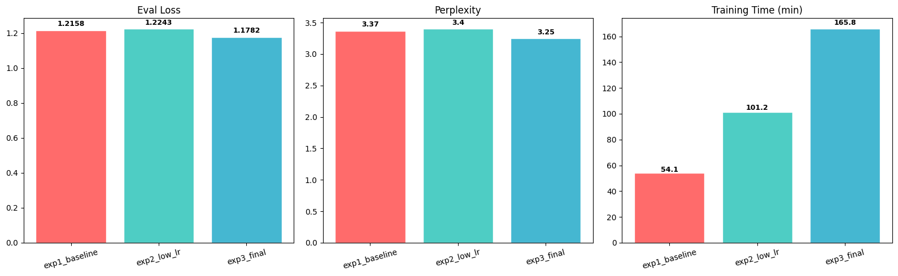
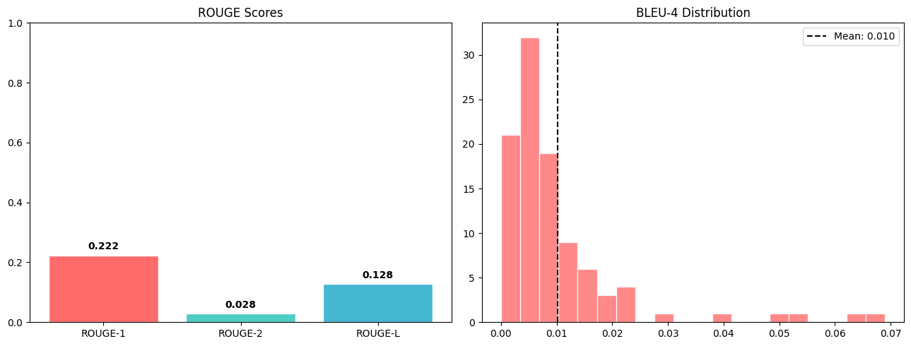
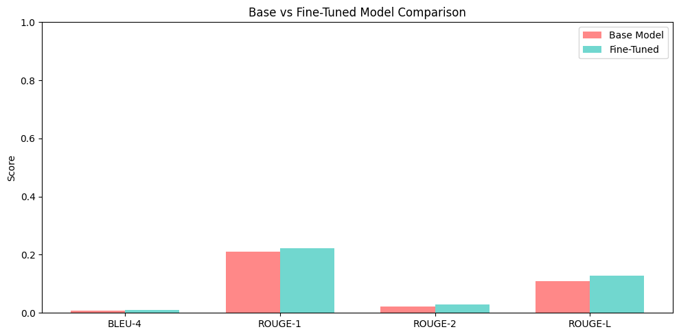

# MamaCare AI: Maternal Health Chatbot for Africa

[](https://colab.research.google.com/drive/16Oirvz1yhIGIWDyw4i5OhTj6HVX1YjtB#scrollTo=-zTfrvtQhu4B)
[](https://www.kaggle.com/code/kerieizereuwonkunda/mamacareai)
[](https://huggingface.co/Kerie1/mamacareai)
[](https://huggingface.co/spaces/Kerie1/mamacare-chatbot-1)

A domain-specific chatbot fine-tuned on TinyLlama-1.1B-Chat to help pregnant women in Africa access accurate maternal health information and dispel dangerous myths.

**Model**: [huggingface.co/Kerie1/mamacareai](https://huggingface.co/Kerie1/mamacareai) | **Live Demo**: [HF Spaces](https://huggingface.co/spaces/Kerie1/mamacare-chatbot-1) | **Report**: [MamaCare_AI_Report.docx](MamaCare_AI_Report.docx)

---

## Project Overview

Maternal mortality in sub-Saharan Africa accounts for ~70% of global maternal deaths (WHO). MamaCare AI addresses this by fine-tuning an LLM to provide evidence-based pregnancy information, correct harmful myths, and redirect off-topic questions.

### Key Features

- **Myth-Busting**: Corrects common pregnancy myths prevalent in African communities
- **Evidence-Based**: Medically accurate information about pregnancy, childbirth, postpartum care
- **Safety Wrapper**: Topic gate + quality check + disclaimer on all responses
- **Out-of-Domain Handling**: Redirects non-maternal questions
- **Gradio UI**: Interactive chat interface with public shareable link

---

## Technical Approach

| Component | Details |
|-----------|---------|
| **Base Model** | TinyLlama-1.1B-Chat-v1.0 (1.1B params) |
| **Method** | LoRA (r=16, alpha=32) in float16 |
| **Trainable Params** | 12,615,680 / 1.1B (1.13%) |
| **Target Modules** | q, k, v, o, gate, up, down proj |
| **Dataset** | 2,657 raw -> 2,130 after aggressive cleaning |
| **Platform** | Kaggle (P100 GPU) |

---

## Training Iterations

Three training iterations were conducted. Each addressed issues found in the previous.

### Iteration 1 (v3) -- QLoRA on Colab T4

Used 4-bit quantization (QLoRA). All 3 experiments completed. Runtime disconnected before artifacts could be saved but results were captured.

| Experiment | LR | BS | Epochs | Train Loss | Eval Loss | PPL | Time |
|-----------|:---:|:--:|:------:|:----------:|:---------:|:---:|:----:|
| Exp 1 | 2e-4 | 4 | 1 | 1.3145 | 1.2158 | 3.37 | 54 min |
| Exp 2 | 5e-5 | 2 | 2 | 1.3604 | 1.2243 | 3.40 | 101 min |
| **Exp 3 (Best)** | **1e-4** | **4** | **3** | **1.2380** | **1.1782** | **3.25** | **166 min** |

v3 Evaluation (Base vs Fine-Tuned):

| Metric | Base | Fine-Tuned | Change |
|--------|:----:|:----------:|:------:|
| BLEU-4 | 0.0088 | 0.0102 | +15.4% |
| ROUGE-1 | 0.2106 | 0.2224 | +5.6% |
| ROUGE-2 | 0.0215 | 0.0284 | +32.2% |
| ROUGE-L | 0.1087 | 0.1280 | +17.8% |
| Perplexity | 11.95 | 2.99 | -75.0% |







### Iteration 2 (v4) -- Issue Discovery

Retrained on Colab with step-based checkpointing. Testing revealed **dataset artifacts** in model responses: doctor names ("Dr. Sagar"), platform references ("Health Care magic"), and formulaic greetings. This came from the `ai-medical-chatbot` source dataset (93% of training data). Led to the aggressive cleaning approach in the final training.

### Iteration 3 (Final) -- LoRA on Kaggle P100

Switched to standard LoRA (float16) since TinyLlama fits without quantization. Applied aggressive dataset cleaning to remove all artifacts.

| Experiment | LR | BS | Epochs | Train Loss | Eval Loss | PPL | Time |
|-----------|:---:|:--:|:------:|:----------:|:---------:|:---:|:----:|
| Exp 1 | 2e-4 | 4 | 1 | 1.2671 | 1.1775 | 3.25 | 9 min |
| **Exp 2 (Best)** | **1e-4** | **4** | **3** | **1.1962** | **1.1473** | **3.15** | **28 min** |
| Exp 3 | 5e-5 | 4 | 2 | 1.2902 | 1.1961 | 3.31 | 19 min |

Final Evaluation (Base vs Fine-Tuned):

| Metric | Base | Fine-Tuned | Change |
|--------|:----:|:----------:|:------:|
| BLEU-4 | 0.0101 | 0.0091 | -9.9% |
| ROUGE-1 | 0.2078 | 0.1990 | -4.2% |
| ROUGE-2 | 0.0271 | 0.0215 | -20.7% |
| ROUGE-L | 0.1106 | 0.0975 | -11.9% |
| Perplexity | 11.53 | 3.54 | -69.3% |

---

## Cross-Training Comparison

| Metric | v3 Best | Final Best | Change |
|--------|:-------:|:----------:|:------:|
| Eval Loss | 1.1782 | 1.1473 | -2.6% |
| Perplexity | 3.25 | 3.15 | -3.1% |
| Train Loss | 1.2380 | 1.1962 | -3.4% |
| Training Time | 165.8 min | 27.9 min | 6x faster |

**Why BLEU/ROUGE dropped but the model improved**: Aggressive cleaning removed formulaic patterns (greetings, sign-offs) that inflated n-gram overlap in v3. The v3 model matched references partly by reproducing dataset artifacts. Perplexity (69% reduction) is the more reliable indicator of domain knowledge for generative tasks.

**Why the final model trained faster**: P100 GPU + float16 LoRA (no quantization overhead) + cleaner data = 6x speedup.

---

## Dataset Cleaning

The key improvement between iterations was aggressive dataset cleaning:

| Step | v3 | Final |
|------|:--:|:-----:|
| Remove doctor greetings | No | Yes |
| Remove "Health Care magic" | No | Yes |
| Remove sign-offs | No | Yes |
| Stricter min length | q > 10 | q > 15, a > 30 |
| Duplicates removed | 378 | 455 |
| Final junk scan | No | Yes (+8 removed) |
| **Final count** | **2,282** | **2,130** |

---

## Safety Features (Final Model)

1. **Topic Gate**: Off-topic questions redirected without calling the model
2. **Quality Check**: Detects gibberish/repetition, returns safe fallback
3. **Disclaimer**: All responses remind users to consult healthcare professionals

---

## How to Run

1. Open [mamacareai.ipynb](mamacareai.ipynb) in **Kaggle** or **Colab**
2. Set runtime to **GPU** (T4 or P100)
3. Run Step 1 (install), **restart runtime**, then run from Step 2
4. Gradio interface launches with a public shareable link

### Requirements

- Python 3.8+, CUDA GPU (8+ GB VRAM), ~5 GB disk space

---

## Repository Structure

```
mamacare-ai/
├── mamacareai.ipynb                       # Final training (LoRA, Kaggle)
├── MaternalHealthChatbot_v3.ipynb         # First training (QLoRA, Colab)
├── MaternalHealthChatbot_v4_fulltrained.ipynb  # Second training (artifact discovery)
├── MamaCare_AI_Report.docx                # Full technical report
├── README.md                              # This file
├── generate_report.py                     # Script to regenerate .docx
└── training-logs/                         # Charts from v3
    ├── dataset_exploration.png
    ├── token_distribution.png
    ├── experiment_comparison.png
    ├── evaluation_metrics.png
    └── base_vs_finetuned.png
```

---

## References

- [TinyLlama](https://github.com/jzhang38/TinyLlama) - Base model
- [LoRA](https://arxiv.org/abs/2106.09685) - Low-Rank Adaptation (Hu et al., 2021)
- [QLoRA](https://arxiv.org/abs/2305.14314) - Quantized LoRA (Dettmers et al., 2023)
- [nashrah18/maternalcareeng](https://huggingface.co/datasets/nashrah18/maternalcareeng)
- [ruslanmv/ai-medical-chatbot](https://huggingface.co/datasets/ruslanmv/ai-medical-chatbot)

---

## Disclaimer

MamaCare AI is an educational project providing **general health information only**. It is **NOT** a substitute for professional medical advice. Always consult a qualified healthcare professional.
